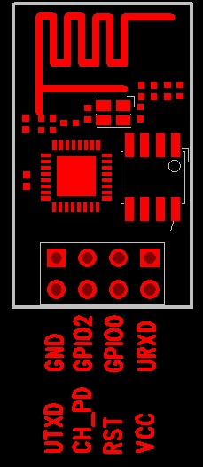

# Table of Contents

- [Introduction](#introduction)
- [Requirements](#requirements)
    - [Hardware](#hardware)
    - [Development](#development)
- [Configuration](#configuration)
    - [Interfaces](#interfaces)
        - [`input`](#input)
        - [`output`](#output)
        - [`mqtt`](#mqtt)
        - [Sensors](#sensors)
            - [`counter`](#counter)
            - [`dht`](#dht)
            - [`dallas`](#dallas)
    - [Actions](#actions)
        - [`publish`](#publish)
        - [`command`](#command)

# Introduction

This is an IoT framework for the ESP8266 WiFi-enabled microcontroller. The
microcontrollers (from now on, called *devices*) communicate with the outside
world through MQTT.

**Note:** The project is still under development. It is not yet tested in any
real environment.

# Requirements

## Hardware

The ESP8266 requires a stable 3.3V input voltage (according to the
specifications, it works from 1.7V to 3.6V, but stable power is needed
otherwise unwanted resets may occur). It can be run from 2 cell batteries (not
recommended for home automation), or from an external power supply, for example
an 5V phone charger and a voltage regulator (for example, an AMS1117-3.3V).

Programming the device is done through serial port. It can be programmed
through USB with an USB to TTL module. These modules usually provide 3.3V
output, but with low power that is only enough to drive the communication
itself, but not enough to power the ESP8266 device. The 5V output of the USB
with a voltage regulator can be used though.

Communication with the server is done through WiFi (b/g/n) network.

Here is the pin layout of the most common ESP8266 configuration. It supports
GPIO ports 0 and 2. Note that in order for the device to boot up properly,
these ports should be pulled up to logical 1 value at boot time.

It is possible to use additional two GPIO ports. If the serial port is
disabled, its ports can be used the same way as the other ports. The UTXD port
is GPIO 1 and URXD is GPIO 3.

## Development

* [ESP8266 toolchain for Eclipse](https://github.com/esp8266/Arduino/blob/master/doc/eclipse/eclipse.rst).
* [ESP8266 toolchain for Arduino IDE](https://github.com/esp8266/Arduino/)
  with [SPIFFS support](https://arduino-esp8266.readthedocs.io/en/latest/filesystem.html#uploading-files-to-file-system).

# Configuration

The configuration of the device is done by uploading the following files to the
ESP:

* `global_config.json`
* `device_config.json`

Examples for these config files are found in the
[example_config](example_config/) directory.

To upload these files to the device, create an empty sketch with the Arduino
IDE and set it up with the parameters of your ESP device. Follow [these
instructions](https://arduino-esp8266.readthedocs.io/en/latest/filesystem.html#uploading-files-to-file-system)
to upload the file to the device.

The `device_config.json` consists of the following fields:

* `name`: The name of the device.
* `debug`: Whether debugging through the serial interface is enabled. If set to
  false, then the TXD port can be used for other purposes. Be aware though that
  some signals are sent through this port at boot time, so it should be used
  with care. **Note:** It only controls serial debugging. Network debugging is
  controlled by `debugPort`.
* `debugPort`: The port by which debugging is done. A client can connect to
  this TCP port (e.g. with `netcat`), and debug messages are sent to the
  client. If the value is 0, no network debugging is done. The default value is
  2534. **Note:** Network debugging is enabled if this parameter is nonzero,
  regardless of the value of the `debug` parameter.
* `availabilityTopic`: The MQTT topic to send a message after boot to indicate
  that the device is online. A will is also sent to this topic if the device
  becomes offline.
* `interfaces`: A list of the interfaces (sensors etc.) used by the device.
* `actions`: A list of the actions that describe how the device should react to
  state changes.

The `global_config.json` contains parameters that are specific to the
environment, not the device itself. Usually, if there are multiple devices,
they share the same `global_config.json`. The parameters are the following:

* `wifiSSID`, `wifiPassword`: The credentials used to log in to the WiFi
  network.
* `servers`: The parameters for the MQTT servers. It is a list of structures,
  one element for each server. If multiple servers are used, then connection is
  made to one of them. If connection to one server fails, the connection fails
  over to another server. The paramters are `address`, `port`, `username` and
  `password`.

## Interfaces

Common parameters to interfaces:

* `name`: The name of the interface.
* `pin`: The GPIO pin used for this interface,
* `type`: The type of the interface.
* `commandTopic`: For interfaces that support commands, these are sent throgu
  this MQTT topic.

Values reported by interfaces are passed to actions. Some interfaces may report
multiple values.

The following interface types are supported.

### `input`

Binary input through a GPIO port. Actions are triggered if the state changes.

### `output`

Binary output through a GPIO port. Similarly to `input`, actions are triggered if
the state changes. The values reported are current state, blink on time, blink
off time.

The following additional value is supported:
* `default`: The default value of the output (a boolean).

This interface supports the following commands:

* `0`/`false`/`off`: Set the port value to 0. Turns off blinking.
* `1`/`true`/`on`: Set the port value to 1. Turns off blinking.
* `toggle`: Toggles the port value. Cannot be used while blinking.
* `blink <on_time> <off_time>`: Switch the interface on and off periodically.
  `on_time` and `off_time` are measured in milliseconds.

### `mqtt`

Subscribes to an MQTT topic. This interface uses no GPIO pin on the device,
only MQTT.

The following additional value is supported:
* `topic`: The topic to subscribe to.

### Sensors

Sensors send their value periodically. Common parameters used for all sensors:

* `interval`: The polling interval in seconds. Default value: 60.
* `offset`: An offset to the polling in seconds. It is useful if the
  measurement takes a long time and there are multiple sensors, to avoid the
  device blocking for a long time. Note that a measurement is always made right
  after boot.

#### `analog`

Reports the output of the ADC port. The 0--1 V range is mapped into 0--1024
values. Since the ESP has only one ADC port, the `pin` parameter is ignored.

#### `counter`

Measures the frequency of a GPIO port switching to 1 state. It can be used, for
example, for tipping bucket rain gauges. The value is reported as switches per
second.

Parameters:

* `multiplier`: Multiply the output with this number. It can be a floating
  point number. For example, if the bucket tips after every 5 ml (=5 cm^3,
  =5000 mm^3), of water, and the input area of the rain gauge is 100 cm^2
  (=10000 mm^2), then set this value to 5000 / 10000 = 0.5 to measure rain in
  mm/s, or 1800 to measure in mm/h.

#### `dht`

DHT11/21/22 temperature and humidity sensor. The first value is the
temperature, measured in °C. The second value is the humidity, measured in %.

Parameters:

* `dhtType`: The type of the sensor (for example, `dht22`).

#### `dallas`

Dallas temperature sensors (e.g. DS18B20). These sensors use the OneWire™
interface, which means that multiple devices can be attached to the same port.
One value is reported for each sensor.

## Actions

Actions are fired by interfaces. The purpose of actions is to process the state
change or value report of the interface.

Common parameters:

* `type`: The type of the action.
* `interface`: The name of the interface the action is attached to.
* `value`: If given, fire only if the value of the interface equals this value.

The following action types are supported.

### `publish`

Publish some value through MQTT.

Parameters:

* `topic`: The MQTT topic to publish to.
* `retain`: Whether the retain flag is to be set. Default is false.
* `template`: The message to send. The substrings _%n_ are substituted by the
  _n_th value of the interface. The default is `%1`.

### `command`

Send a direct command to an interface. It works even if the MQTT server is not
reachable. However Wifi connection still needs to be up.

Parameters:

* `target`: The name of the target interface, where the command is sent.
* `command`: The command to send to the target interface. Value substitution is
  done similarly to the `template` parameter of the `publish` action.
