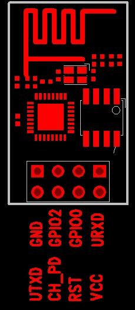

# Table of Contents

- [Introduction](#introduction)
- [Requirements](#requirements)
    - [Hardware](#hardware)
    - [Development](#development)
- [Configuration](#configuration)
    - [`device_config.json`](#device_configjson)
    - [`global_config.json`](#global_configjson)
    - [`analogInputs`](#analoginputs)
    - [Interfaces](#interfaces)
        - [`input`](#input)
        - [`output`](#output)
        - [`pwm`](#pwm)
        - [`mqtt`](#mqtt)
        - [`status`](#status)
        - [`encoder`](#encoder)
        - [`keepalive`](#keepalive)
        - [`powerSupply`](#powersupply)
        - [`cover`](#cover)
        - [Sensors](#sensors)
            - [`analog`](#analog)
            - [`counter`](#counter)
            - [`dht`](#dht)
            - [`dallasTemperature`](#dallastemperature)
            - [`hm3301`](#hm3301)
            - [`hc-sr04` / `echo-distance`](#hc-sr04--echo-distance)
    - [Actions](#actions)
        - [`publish`](#publish)
        - [`command`](#command)
    - [Operations](#operations)
        - [String expression syntax](#string-expression-syntax)
        - [Template syntax](#template-syntax)

# Introduction

This is an IoT framework for the ESP8266 WiFi-enabled microcontroller. The
microcontrollers (from now on, called *devices*) communicate with the outside
world through MQTT.

**Note:** The project is still under development. It is not yet tested in any
real environment.

# Requirements

## Hardware

The ESP8266 requires a stable 3.3V input voltage (according to the
specifications, it works from 1.7V to 3.6V, but stable power is needed
otherwise unwanted resets may occur). It can be run from 2 cell batteries (not
recommended for home automation), or from an external power supply, for example
an 5V phone charger and a voltage regulator (for example, an AMS1117-3.3V).

Programming the device is done through serial port. It can be programmed
through USB with an USB to TTL module. These modules usually provide 3.3V
output, but with low power that is only enough to drive the communication
itself, but not enough to power the ESP8266 device. The 5V output of the USB
with a voltage regulator can be used though.

Communication with the server is done through WiFi (b/g/n) network.

Here is the pin layout of the most common ESP8266 configuration. It supports
GPIO ports 0 and 2. Note that in order for the device to boot up properly,
these ports should be pulled up to logical 1 value at boot time.



It is possible to use additional two GPIO ports. If the serial port is
disabled, its ports can be used the same way as the other ports. The UTXD port
is GPIO 1 and URXD is GPIO 3.

## Development

* [Arduino CLI](https://docs.arduino.cc/arduino-cli/)
* [ESP8266 toolchain for Arduino IDE](https://github.com/esp8266/Arduino/)
* [SPIFFS support](https://arduino-esp8266.readthedocs.io/en/latest/filesystem.html#uploading-files-to-file-system).

## Building and flashing with `flash.py`

The `flash.py` helper script wraps `arduino-cli` to build the firmware, upload
it, and upload a SPIFFS filesystem image from a single config file. It requires
`arduino-cli` and the ESP8266 core (`esp8266:esp8266`) to be installed.

Settings live in `flash.toml` (path configurable with `-c`):

```toml
[build]
fqbn = "esp8266:esp8266:generic"
port = "/dev/ttyUSB0"

[build.board_options]
baud = "921600"
# eesz = "4M2M"  # override default 1M64 for a bigger filesystem

[upload]
verify = true
```

Commands:

```
python3 flash.py compile                                   # build only
python3 flash.py upload                                    # build + upload firmware
python3 flash.py upload-fs data example_config             # build SPIFFS image, upload it
python3 flash.py inspect-fs data example_config            # verify image: build, unpack, show contents
python3 flash.py inspect-fs -o /tmp/fsout data             # keep image + unpacked tree for inspection
python3 flash.py -n upload-fs data                         # dry run: print commands only
python3 flash.py -c custom.toml -s /path/to/sketch upload
```

`upload-fs` resolves the SPIFFS partition offset/size from the board options
(via `arduino-cli board details --show-properties`), so it picks the correct
flash address automatically. The filesystem is built with the `mkspiffs`
bundled with the ESP8266 core.

# Configuration

The configuration of the device is done by uploading the following files to the
ESP:

*   `global_config.json`
*   `device_config.json`

Examples for these config files are found in the
[example_config](example_config/) directory.

To upload these files to the device, use `flash.py upload-fs` (see
[Building and flashing](#building-and-flashing-with-flashpy) above).

## `device_config.json`

The `device_config.json` consists of the following fields:

*   `name`: The name of the device.
*   `debug`: Whether debugging through the serial interface is enabled. If set
    to false, then the TXD port can be used for other purposes. Be aware
    though that some signals are sent through this port at boot time, so it
    should be used with care. **Note:** It only controls serial debugging.
    Network debugging is controlled by `debugPort`.
*   `debugPort`: The port by which debugging is done. A client can connect to
    this TCP port (e.g. with `netcat`), and debug messages are sent to the
    client. If the value is 0, no network debugging is done. The default value
    is 2534. **Note:** Network debugging is enabled if this parameter is
    nonzero, regardless of the value of the `debug` parameter.
*   `debugTopic`: The MQTT topic to publish debug messages to. If empty, no
    debug messages are published via MQTT.
*   `availabilityTopic`: The MQTT topic to send a message after boot to
    indicate that the device is online. A will is also sent to this topic if
    the device becomes offline.
*   `statusTopic`: The MQTT topic used for device discovery/status handshaking.
    The device publishes its name and MAC address here, as well as various debug
    information.
*   `resetPin`: A GPIO pin connected to the reset pin. Use it to hard reset the
    device from software (should not be needed under normal circumstances).
    Set to a value > 16 to disable.
*   `analogInputs`: A list of shared analog input hardware definitions (see
    [`analogInputs`](#analoginputs) below).
*   `interfaces`: A list of the interfaces (sensors etc.) used by the device.
*   `actions`: A list of the actions that describe how the device should react
    to state changes.

## `global_config.json`

The `global_config.json` contains parameters that are specific to the
environment, not the device itself. Usually, if there are multiple devices,
they share the same `global_config.json`. The parameters are the following:

*   `wifiSSID`, `wifiPassword`: The credentials used to log in to the WiFi
    network.
*   `servers`: The parameters for the MQTT servers. It is a list of
    structures, one element for each server. If multiple servers are used,
    then connection is made to one of them. If connection to one server fails,
    the connection fails over to another server. The paramters are `address`,
    `port`, `username` and `password`.

## `analogInputs`

A top-level list in `device_config.json` that defines shared analog input
hardware referenced by [`analog`](#analog) sensor interfaces. Each entry:

*   `name`: The name of the input, referenced by the `analog` interface's
    `input` field as `name.channel`.
*   `type`: The type of the input hardware. Currently only `mcp3008` is
    supported.
*   `sck`: SPI clock pin (MCP3008).
*   `mosi`: SPI MOSI pin (MCP3008).
*   `miso`: SPI MISO pin (MCP3008).
*   `cs`: SPI chip select pin (MCP3008).

If an `analog` interface's `input` field is empty, the ESP onboard ADC is used.

## Interfaces

Common parameters to interfaces:

*   `name`: The name of the interface.
*   `pin`: The GPIO pin used for this interface.
*   `type`: The type of the interface.
*   `commandTopic`: For interfaces that support commands, these are sent through
    this MQTT topic.

Values reported by interfaces are passed to actions. Some interfaces may report
multiple values.

The following interface types are supported.

### `input`

Binary input through a GPIO port. Actions are triggered if the state changes.

The following additional values are supported:
*   `cycle`: Controls the behaviour when the device responds slowly and the
    input state changes multiple times between cycles. Possible values:
    *   `none`: No change detection is used. Always the current value is
        reported.
    *   `single`: This is the default. If the state changed and then changed
        back during a cycle, the changes are reported, but no additional
        changes are reported. If the state changes multiple times, then ends up
        on a different state then the original, then only one change is
        reported. This is useful, for example, for manual switches, when the
        user might push a button multiple times when there is no answer, and we
        want to react only once.
    *   `multi`: All state changes between cycles are reported.
*   `debounce`: The minimum time interval in milliseconds between successive
    state changes for them to be counted as real. Default value: 10.

### `output`

Binary output through a GPIO port. Similarly to `input`, actions are triggered if
the state changes. The values reported are current state, blink on time, blink
off time.

The following additional values are supported:
*   `default`: The default value of the output (a boolean).
*   `invert`: If true, the pin logic is inverted (negative logic).

This interface supports the following commands:

*   `0`/`false`/`off`: Set the port value to 0. Turns off blinking.
*   `1`/`true`/`on`: Set the port value to 1. Turns off blinking.
*   `toggle`: Toggles the port value. Cannot be used while blinking.
*   `blink <on_time> <off_time>`: Switch the interface on and off periodically.
    `on_time` and `off_time` are measured in milliseconds.

### `pwm`

PWM output through a GPIO port using `analogWrite`. The value reported is the
current PWM value.

The following additional values are supported:
*   `default`: The default PWM value (0--255).
*   `invert`: If true, the value is inverted (`maxValue - value`).

This interface supports the following commands:

*   `<number>`: Set the PWM value (0--255).
*   `+<number>` / `-<number>`: Increase/decrease the PWM value by the given
    amount.
*   `on`/`true`: Set to maximum value (255).
*   `off`/`false`: Set to 0.

### `mqtt`

Subscribes to an MQTT topic. This interface uses no GPIO pin on the device,
only MQTT.

The following additional value is supported:
*   `topic`: The topic to subscribe to.

### `status`

Reports the MQTT connection state of the device. The value is `1` when
connected and `0` when disconnected. This interface uses no GPIO pin and takes
no additional parameters.

### `encoder`

Rotary encoder using two GPIO pins. The value reported is the encoder count.

The following additional values are supported:
*   `downPin`: The GPIO pin for the down direction (required).
*   `upPin`: The GPIO pin for the up direction (required).
*   `pulse`: If true, the encoder value is reset after each report (boolean).
    Default value: false.

### `keepalive`

Watchdog interface that periodically pulses a GPIO pin to keep an external
device alive (e.g. preventing another microcontroller from sleeping).

The following additional values are supported:
*   `pin`: The GPIO pin to pulse (required).
*   `interval`: The time between keepalive pulses, in milliseconds. Default
    value: 10000.
*   `resetInterval`: After this many millisecond, the reset pin is pulsed.
    Default value: 10. **Note:** keep it low, this delay is synchronous.

### `powerSupply`

Controls an ATX-style power supply via GPIO pins.

The following additional values are supported:
*   `powerSwitchPin`: GPIO pin to toggle power (required).
*   `resetSwitchPin`: GPIO pin to toggle reset (required).
*   `powerCheckPin`: GPIO pin to check power state (required).
*   `pushTime`: Button push duration in milliseconds. Default value: 200.
*   `forceOffTime`: Force-off duration in milliseconds. Default value: 6000.
*   `checkTime`: Check interval in milliseconds. Default value: 60000.
*   `initialState`: Initial power state (`"on"`, `"off"`, or other). Default
    value: `""`.

### `cover`

Controls a motorized cover (gate, shutter, etc.). Outputs the current state
(`OPENING`, `CLOSING`, `OPEN`, `CLOSED`) and position.

The following additional values are supported:
*   `upMovementPin`: Input pin detecting that the cover is opening (required).
*   `downMovementPin`: Input pin detecting that the cover is closing (required).
*   `upPin`: Output pin controlling opening movement (required).
*   `downPin`: Output pin controlling closing movement (required).
*   `stopPin`: Output pin for stopping movement (latching mode only).
*   `latching`: If true, the cover works in latching mode (pin is pulsed then
    released, stopped by the stop pin). If false, the pin is held while moving.
    Default value: false.
*   `invertInput`: Invert the logic of the movement input pins. Default value:
    false.
*   `invertOutput`: Invert the logic of the up/down output pins. Default value:
    false.
*   `invertPositionSensors`: Invert the logic of all position sensors. Default
    value: false.
*   `closedPosition`: Position threshold for the "closed" state. If the
    position is above this value, the state is reported as open. Default value:
    0.
*   `positionSensors`: A list of position sensor objects:
    *   `position`: The position value for this sensor (required).
    *   `pin`: The GPIO pin for this sensor (required).
    *   `invert`: If true, invert the logic of this individual sensor. Default
        value: false. Cumulative with `invertPositionSensors` (if both are
        true, the sensor uses positive logic).

This interface supports the following commands:

*   `OPEN`: Start opening. No calibration.
*   `CLOSE`: Start closing. No calibration.
*   `STOP`: Stop moving.
*   `<number>`: Set to a target position. Calibrates if needed.

### Sensors

Sensors send their value periodically. Common parameters used for all sensors:

*   `interval`: The polling interval in seconds. Default value: 60.
*   `intervalMs`: Alternative to `interval`, specified in milliseconds. If
    nonzero, takes precedence over `interval`.
*   `offset`: An offset to the polling in seconds. It is useful if the
    measurement takes a long time and there are multiple sensors, to avoid the
    device blocking for a long time. Note that a measurement is always made
    right after boot.
*   `pulse`: If set, the value of the sensor is reset to this value after
    measurement. For example, a value of 0 means that at each measurement, the
    value of the sensor is processed, then it is reset to 0 in the next tick.
    This can be a single string or an array of strings.

#### `analog`

Reports the output of an analog-to-digital converter. By default, the ESP
onboard ADC is used (the 0--1 V range is mapped into 0--1024 values), and the
`pin` parameter is ignored. An external ADC (e.g. MCP3008) can be used via the
`input` field; see [`analogInputs`](#analoginputs).

The following additional values are supported:
*   `input`: A reference to an `analogInputs` entry as `name.channel`. If
    empty, the ESP onboard ADC is used.
*   `max`: The maximum raw value for scaling. Default value: 0.
*   `valueOffset`: An offset added to the measured value. Default value: 0.
*   `cutoff`: A cutoff threshold. Default value: 0.
*   `precision`: The number of decimal places in the output string. Default
    value: 0.
*   `aggregateTime`: The aggregation window length. Default value: 0.
*   `aggregateDelay`: The aggregation delay. Default value: 0.

#### `counter`

Measures the frequency of a GPIO port switching to 1 state. It can be used, for
example, for tipping bucket rain gauges. The value is reported as switches per
second.

Parameters:

*   `multiplier`: Multiply the output with this number. It can be a floating
    point number. For example, if the bucket tips after every 5 ml (=5 cm^3,
    =5000 mm^3), of water, and the input area of the rain gauge is 100 cm^2
    (=10000 mm^2), then set this value to 5000 / 10000 = 0.5 to measure rain in
    mm/s, or 1800 to measure in mm/h.
*   `bounceTime`: The minimum time interval between successive switches, in
    milliseconds. If the value switches more than once in this interval, it is
    counted as one switch.

#### `dht`

DHT11/21/22 temperature and humidity sensor. The first value is the
temperature, measured in °C. The second value is the humidity, measured in %.

Parameters:

*   `dhtType`: The type of the sensor. Accepted values: `dht11`, `dht22`,
    `dht21`, or `""` (defaults to DHT22).

#### `dallasTemperature`

Dallas temperature sensors (e.g. DS18B20). These sensors use the OneWire™
interface, which means that multiple devices can be attached to the same port.
One value is reported for each sensor.

Parameters:
*   `devices`: The number of devices attached to the bus. Defaults to 1 if 0
    or absent.

#### `hm3301`

HM3301 particulate matter sensor. Uses I2C, so no `pin` parameter is needed.

Parameters:
*   `sda`: The I2C SDA pin (required).
*   `scl`: The I2C SCL pin (required).

#### `hc-sr04` / `echo-distance`

Ultrasonic distance sensor (HC-SR04). Reports the distance. The type can be
specified as either `hc-sr04` or `echo-distance`.

Parameters:
*   `echoPin`: The GPIO pin connected to the echo output (required).
*   `triggerPin`: The GPIO pin connected to the trigger input. If 0, the
    interface operates in reader-only mode: the device should trigger
    automatically.
*   `triggerTime`: The trigger pulse length in milliseconds. Default value: 10.

## Actions

Actions are fired by interfaces. The purpose of actions is to process the state
change or value report of the interface.

Common parameters:

*   `type`: The type of the action.
*   `interface`: The name of the interface the action is attached to.
*   `value`: If given, fire only if the value of the interface equals this value.

The following action types are supported.

### `publish`

Publish some value through MQTT.

Parameters:

*   `topic`: The MQTT topic to publish to.
*   `retain`: Whether the retain flag is to be set. Default is false.
*   `payload`: The payload of the message. It is an [operation](#operations).
    Alternatively, `template` can be used for a simpler way to substitute
    values.
*   `minimumSendInterval`: The minimum time in milliseconds between publishes.
    If set, repeated messages within this interval are suppressed. Default
    value: 0 (no suppression).
*   `sendDiff`: Only publish if the numeric value has changed by at least this
    amount. Default value: 0 (always publish).

**Note:** `minimumSendInterval` and `sendDiff` work in _or_ mode: value is sent
after `minimumSendInterval` or if the value changes more than `sendDiff`.

### `command`

Send a direct command to an interface. It works even if the MQTT server is not
reachable. However Wifi connection still needs to be up.

Parameters:

*   `target`: The name of the target interface, where the command is sent.
*   `command`: The command to send to the target interface. An
    [operation](#operations), works the same as `payload` for Publish actions.
    `template` can also be used.

## Operations

Actions use operations to compute the value to publish or the command to send.
An operation is specified as a [string expression](#string-expression-syntax).
A simpler [template](#template-syntax) syntax is also available.

If neither `payload` nor `template` is specified for a `publish` action, the
default template `%1` is used (the first value of the action's interface).

If the action has a `value` field, the operation is only evaluated when the
interface value equals that value; otherwise an empty string is produced.

### String expression syntax

When `payload` (for `publish`) or `command` (for `command`) is a string, it is
parsed as an expression. The expression supports the following operators,
listed by precedence (lowest to highest):

| Operator | Description |
|---|---|
| `?:` | Ternary conditional: `cond ? then : else` |
| `\|\|` | Logical OR |
| `&&` | Logical AND |
| `==` `!=` | Numeric equality/inequality |
| `s==` `s!=` | String equality/inequality |
| `<` `>` `<=` `>=` | Numeric comparison |
| `s<` `s>` `s<=` `s>=` | String comparison |
| `+` `-` | Numeric addition/subtraction |
| `s+` | String concatenation |
| `*` `/` | Numeric multiplication/division |
| `!` | Logical NOT (unary) |
| `-` | Numeric negation (unary) |

Primary expressions:

*   Numbers: `42`, `3.14`.
*   String literals: `'hello'` (use `\\'` for an escaped quote and `\\\\` for a
    literal backslash).
*   Boolean constants: `true`/`on` (evaluates to 1), `false`/`off` (evaluates
    to 0).
*   Interface values: `[name]` (first value of interface `name`),
    `[name.index]` (the `index`-th value, default index is 1).
*   Default interface value: `%N` (the `N`-th value of the action's `interface`).
*   Parenthesized expressions: `(expr)`.

### Template syntax

The `template` field provides simple value substitution. `%1`, `%2`, etc. are
replaced by the corresponding stored value of the interface (1-based). For
example, `template: "%2 %3"` produces the second and third values separated by a
space.
